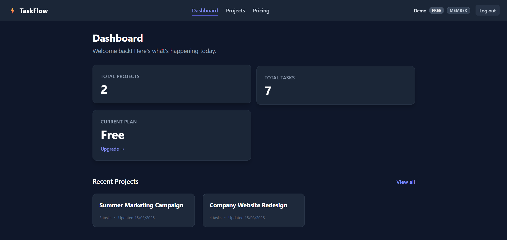
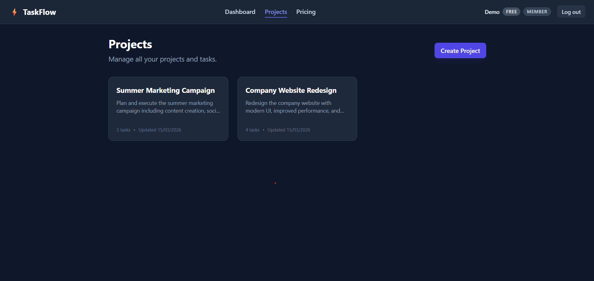
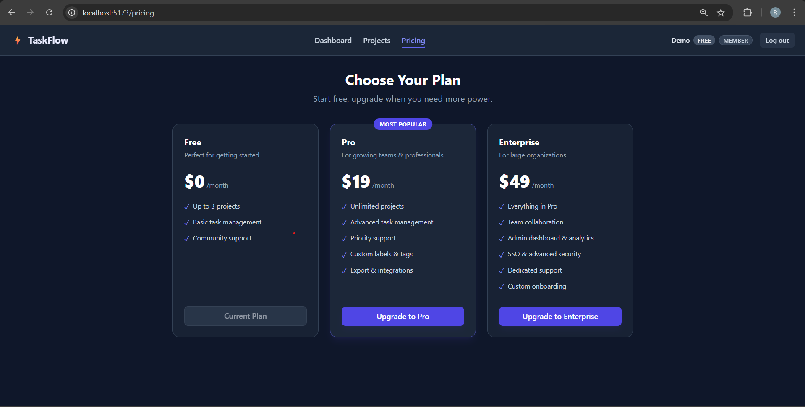
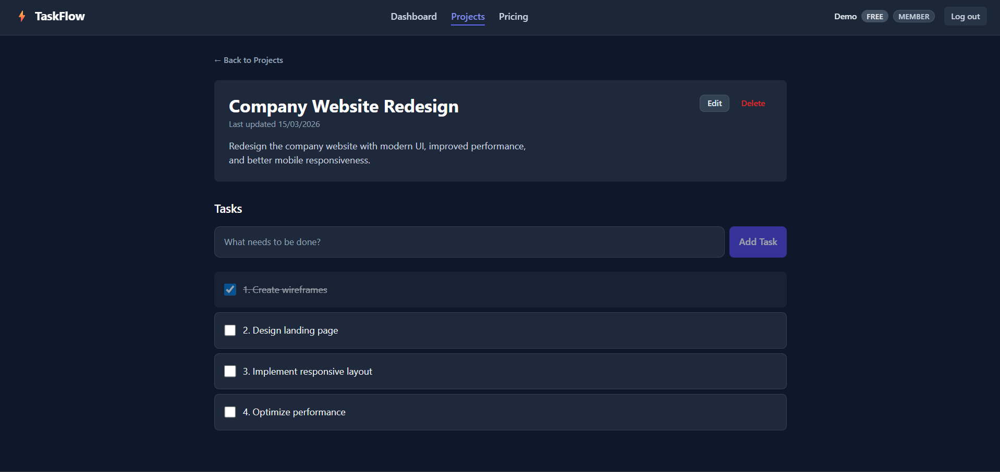

# SaaS App - Project Management Platform

## Overview
A full-stack SaaS task management platform with role-based access, project management, and Stripe subscription billing.

## Problem Solved
Many teams need a lightweight project management SaaS with subscription billing and role-based access control. This project demonstrates how such a system can be built with modern web technologies.

## Tech Stack
Frontend: React + TypeScript
Backend: Node.js + Express
Database: PostgreSQL (via Prisma)
Auth: JWT + Role-Based Access Control
Payments: Stripe subscriptions

## Architecture
```
User
 ├── Authentication
 ├── Roles (Admin / Member / Viewer)
 ├── Projects
 │     └── Tasks
 └── Subscription (Stripe)
```

## Stripe Integration
- **subscription plans**: Users can choose from different tiers to match their usage limits.
- **checkout**: Stripe Checkout is used for secure and seamless payment collection.
- **webhook handling**: The app listens for Stripe events to keep local database subscriptions in sync.
- **plan restrictions**: Based on the active tier, limits are automatically enforced on creating new projects or tasks.

## Auth + RBAC
- **JWT authentication**: Stateless and secure session management.
- **role-based access**: `ADMIN`, `MEMBER`, and `VIEWER` roles dictate what resources can be muttered or viewed.
- **protected routes**: Frontend routing and backend middlewares actively guard areas of the application based on session validity and role.

## Quick Start (Development)

First, clone the repository and set up the environment variables:
```bash
# Server Environment
cp server/.env.example server/.env
# Client Environment 
cp client/.env.example client/.env
```

### Backend (Server)
The Express REST API uses Prisma ORM and requires PostgreSQL.

```bash
cd server
npm install

# Setup Database & Prisma
npx prisma generate
npx prisma migrate dev

# Start development server on PORT (default 5000)
npm run dev
```

### Frontend (Client)
The React SPA is built with Vite, TypeScript, and TailwindCSS.

```bash
cd client
npm install

# Start development server on default HTTP://localhost:5173
npm run dev
```

## Project Structure

### Backend (`/server`)
```
server/
├── prisma/
│   ├── schema.prisma      # Data models & enums
│   └── migrations/        # SQL migration history
├── src/
│   ├── index.ts           # Express app setup & route mounting
│   ├── db.ts              # Prisma client singleton
│   ├── authMiddleware.ts  # JWT verification, role loading, mutation guard
│   ├── *Routes.ts         # Resource endpoints (auth, projects, tasks, admin, stripe)
```

### Frontend (`/client`)
```
client/src/
├── components/
│   └── Layout.tsx          # App shell with navigation
├── contexts/
│   └── AuthContext.tsx     # Auth state & JWT management
├── pages/
│   ├── Login/Register.tsx  # Authentication forms
│   ├── Dashboard.tsx       # Dashboard with stats
│   ├── Projects.tsx        # Projects list and forms
│   ├── ProjectDetail.tsx   # Tasks inside a project
│   ├── Pricing.tsx         # Stripe billing
│   └── ProtectedRoute.tsx  # Auth route guard
├── api.ts                  # Axios instance with auth interceptor
└── App.tsx                 # Routing
```

## Screenshots

### Dashboard


### Project Page


### Pricing Page


### Tasks Page

